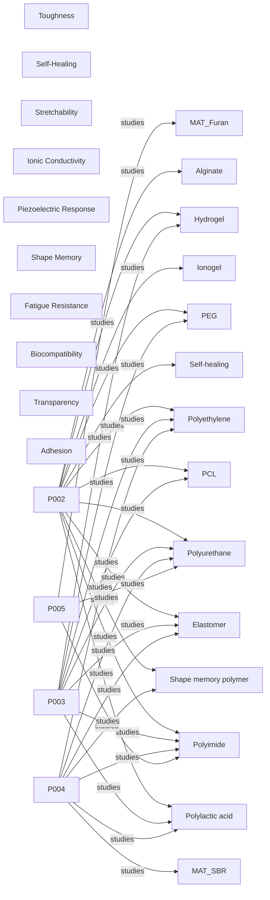

# Knowledge Graph - Mermaid Diagrams

## 1. Research Topic Overview

```mermaid
graph TD
    CAT_ionic_liquid["Ionic Liquid"]
    CAT_hydrogel["Hydrogel"]
    CAT_other["Other"]
    CAT_biocompatibility["Biocompatibility"]
    CAT_gel["Gel"]
    CAT_shape_memory["Shape Memory"]
    CAT_triboelectric["Triboelectric"]
    CAT_computational["Computational"]
    CAT_adaptive_network["Adaptive Network"]
    CAT_adhesion["Adhesion"]
    CAT_ionomer["Ionomer"]
    CAT_crystallization["Crystallization"]
    CAT_fluorescence["Fluorescence"]
    CAT_synthesis["Synthesis"]
    CAT_piezoelectric["Piezoelectric"]
```

## 2. Material System Relationships

```mermaid
graph LR
    MAT_Polyimide["Polyimide"]
    MAT_Self_healing["Self-healing"]
    MAT_Polyurethane["Polyurethane"]
    MAT_Ionogel["Ionogel"]
    MAT_Polylactic_acid["Polylactic acid"]
    MAT_PCL["PCL"]
    MAT_Alginate["Alginate"]
    MAT_Shape_memory_polymer["Shape memory polymer"]
    MAT_PEG["PEG"]
    MAT_Elastomer["Elastomer"]
    MAT_Hydrogel["Hydrogel"]
    MAT_Polyethylene["Polyethylene"]
    PROP_Toughness["Toughness"]
    PROP_Self_Healing["Self-Healing"]
    PROP_Stretchability["Stretchability"]
    PROP_Ionic_Conductivity["Ionic Conductivity"]
    PROP_Piezoelectric["Piezoelectric Response"]
    PROP_Shape_Memory["Shape Memory"]
    PROP_Fatigue_Resistance["Fatigue Resistance"]
    PROP_Biocompatibility["Biocompatibility"]
    PROP_Transparency["Transparency"]
    PROP_Adhesion["Adhesion"]
    P002 -->|studies| MAT_Polyimide
    P002 -->|studies| MAT_Self_healing
    P002 -->|studies| MAT_Polyurethane
    P002 -->|studies| MAT_Ionogel
    P002 -->|studies| MAT_Polylactic_acid
    P002 -->|studies| MAT_PCL
    P002 -->|studies| MAT_Alginate
    P002 -->|studies| MAT_Shape_memory_polymer
    P002 -->|studies| MAT_PEG
    P002 -->|studies| MAT_Elastomer
    P002 -->|studies| MAT_Hydrogel
    P002 -->|studies| MAT_Polyethylene
    P003 -->|studies| MAT_Polyimide
    P003 -->|studies| MAT_Polyurethane
    P003 -->|studies| MAT_Polylactic_acid
    P003 -->|studies| MAT_PCL
    P003 -->|studies| MAT_PEG
    P003 -->|studies| MAT_Elastomer
    P003 -->|studies| MAT_Hydrogel
    P003 -->|studies| MAT_Polyethylene
    P004 -->|studies| MAT_Polyimide
    P004 -->|studies| MAT_Polyurethane
    P004 -->|studies| MAT_Polylactic_acid
    P004 -->|studies| MAT_Shape_memory_polymer
    P004 -->|studies| MAT_Elastomer
    P004 -->|studies| MAT_SBR
    P004 -->|studies| MAT_Polyethylene
    P005 -->|studies| MAT_Furan
    P005 -->|studies| MAT_Polyimide
    P005 -->|studies| MAT_Polyurethane
```

## 3. Characterization Method Network

```mermaid
graph TD
    METHOD_DMA["DMA"]
    METHOD_DSC["DSC"]
    METHOD_SEM["SEM"]
    METHOD_MD_Simulation["MD Simulation"]
    METHOD_TEM["TEM"]
    METHOD_Tensile["Tensile"]
    METHOD_Rheology["Rheology"]
    METHOD_AFM["AFM"]
    METHOD_SAXS["SAXS"]
    METHOD_TGA["TGA"]
    METHOD_GPC["GPC"]
    METHOD_WAXD["WAXD"]
    METHOD_FTIR["FTIR"]
    METHOD_NMR["NMR"]
    METHOD_DLS["DLS"]
```

## 4. Scientific Questions Network

```mermaid
graph TD
    SQ1["How do molecular architecture and processing contr"]
    SQ2["What governs the balance between mechanical toughn"]
    SQ3["How do ionic interactions affect both mechanical a"]
    SQ4["What controls crystallization kinetics in dynamic "]
    SQ5["How can piezoelectric response be enhanced in soft"]
    SQ6["What is the role of chain entanglement in tougheni"]
    SQ7["How do dynamic bonds influence viscoelastic behavi"]
    SQ8["Can machine learning predict polymer structure-pro"]
```

