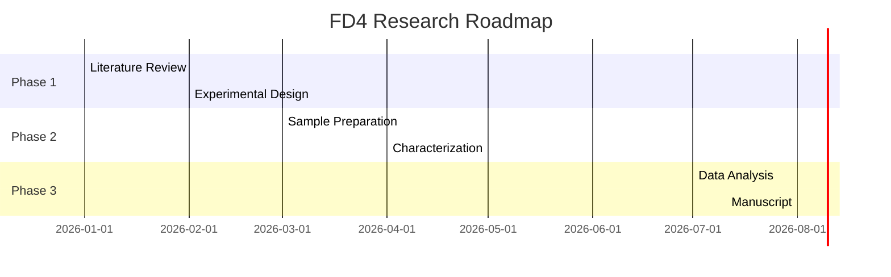

# Research Roadmaps

Generated: 2026-05-22 09:27:39

## FD1: Machine Learning-Guided Design of Self-Healing Polyurethanes

### Short-term Goals (0-6 months)

- Literature review and gap analysis
- Experimental design and protocol development
- Preliminary sample preparation
- Initial characterization
- Feasibility assessment

### Medium-term Goals (6-18 months)

- Systematic variable studies
- Mechanism validation
- Model development/calibration
- Performance optimization
- Manuscript preparation

### Long-term Goals (18-36 months)

- Theory completion
- Application validation
- High-impact publication
- Grant application
- Platform expansion

### Technical Roadmap (Mermaid)

### Key Experiments

| Experiment | Purpose | Timeline |
|------------|---------|----------|
| Sample synthesis | Material preparation | Month 1-2 |
| Mechanical testing | Property evaluation | Month 3-4 |
| Morphology characterization | Structure analysis | Month 3-5 |
| Mechanism studies | Fundamental understanding | Month 4-6 |
| Optimization | Performance improvement | Month 6-12 |

### Risk Management

- **Primary risk**: Model may not generalize beyond training data.
- **Mitigation**: Bayesian optimization with smaller experimental campaigns.

---

## FD2: In Situ SAXS/DMA Coupling for Real-Time Microphase Separation Dynamics

### Short-term Goals (0-6 months)

- Literature review and gap analysis
- Experimental design and protocol development
- Preliminary sample preparation
- Initial characterization
- Feasibility assessment

### Medium-term Goals (6-18 months)

- Systematic variable studies
- Mechanism validation
- Model development/calibration
- Performance optimization
- Manuscript preparation

### Long-term Goals (18-36 months)

- Theory completion
- Application validation
- High-impact publication
- Grant application
- Platform expansion

### Technical Roadmap (Mermaid)

### Key Experiments

| Experiment | Purpose | Timeline |
|------------|---------|----------|
| Sample synthesis | Material preparation | Month 1-2 |
| Mechanical testing | Property evaluation | Month 3-4 |
| Morphology characterization | Structure analysis | Month 3-5 |
| Mechanism studies | Fundamental understanding | Month 4-6 |
| Optimization | Performance improvement | Month 6-12 |

### Risk Management

- **Primary risk**: Beam damage, limited time resolution.
- **Mitigation**: Lab-scale SAXS with slower heating rates.

---

## FD3: Ionic Liquid-Enabled Ultra-Stretchable Ionogels for Biomedical Applications

### Short-term Goals (0-6 months)

- Literature review and gap analysis
- Experimental design and protocol development
- Preliminary sample preparation
- Initial characterization
- Feasibility assessment

### Medium-term Goals (6-18 months)

- Systematic variable studies
- Mechanism validation
- Model development/calibration
- Performance optimization
- Manuscript preparation

### Long-term Goals (18-36 months)

- Theory completion
- Application validation
- High-impact publication
- Grant application
- Platform expansion

### Technical Roadmap (Mermaid)

### Key Experiments

| Experiment | Purpose | Timeline |
|------------|---------|----------|
| Sample synthesis | Material preparation | Month 1-2 |
| Mechanical testing | Property evaluation | Month 3-4 |
| Morphology characterization | Structure analysis | Month 3-5 |
| Mechanism studies | Fundamental understanding | Month 4-6 |
| Optimization | Performance improvement | Month 6-12 |

### Risk Management

- **Primary risk**: IL leaching, long-term biocompatibility unknown.
- **Mitigation**: Encapsulated ionogel designs to prevent IL exposure.

---

## FD4: Piezoelectric Polymer Composites for Self-Powered Wearable Sensors

### Short-term Goals (0-6 months)

- Literature review and gap analysis
- Experimental design and protocol development
- Preliminary sample preparation
- Initial characterization
- Feasibility assessment

### Medium-term Goals (6-18 months)

- Systematic variable studies
- Mechanism validation
- Model development/calibration
- Performance optimization
- Manuscript preparation

### Long-term Goals (18-36 months)

- Theory completion
- Application validation
- High-impact publication
- Grant application
- Platform expansion

### Technical Roadmap (Mermaid)

### Key Experiments

| Experiment | Purpose | Timeline |
|------------|---------|----------|
| Sample synthesis | Material preparation | Month 1-2 |
| Mechanical testing | Property evaluation | Month 3-4 |
| Morphology characterization | Structure analysis | Month 3-5 |
| Mechanism studies | Fundamental understanding | Month 4-6 |
| Optimization | Performance improvement | Month 6-12 |

### Risk Management

- **Primary risk**: Filler agglomeration at high loading.
- **Mitigation**: Electrospun nanofiber composites for better dispersion.

---

## FD5: Dynamic Covalent Chemistry for Recyclable Thermoset Elastomers

### Short-term Goals (0-6 months)

- Literature review and gap analysis
- Experimental design and protocol development
- Preliminary sample preparation
- Initial characterization
- Feasibility assessment

### Medium-term Goals (6-18 months)

- Systematic variable studies
- Mechanism validation
- Model development/calibration
- Performance optimization
- Manuscript preparation

### Long-term Goals (18-36 months)

- Theory completion
- Application validation
- High-impact publication
- Grant application
- Platform expansion

### Technical Roadmap (Mermaid)

### Key Experiments

| Experiment | Purpose | Timeline |
|------------|---------|----------|
| Sample synthesis | Material preparation | Month 1-2 |
| Mechanical testing | Property evaluation | Month 3-4 |
| Morphology characterization | Structure analysis | Month 3-5 |
| Mechanism studies | Fundamental understanding | Month 4-6 |
| Optimization | Performance improvement | Month 6-12 |

### Risk Management

- **Primary risk**: Dynamic bond exchange may compromise mechanical integrity.
- **Mitigation**: Hybrid networks with permanent and dynamic crosslinks.

---

## FD6: Phase-Engineered Piezoionic Elastomers for Soft Robotics

### Short-term Goals (0-6 months)

- Literature review and gap analysis
- Experimental design and protocol development
- Preliminary sample preparation
- Initial characterization
- Feasibility assessment

### Medium-term Goals (6-18 months)

- Systematic variable studies
- Mechanism validation
- Model development/calibration
- Performance optimization
- Manuscript preparation

### Long-term Goals (18-36 months)

- Theory completion
- Application validation
- High-impact publication
- Grant application
- Platform expansion

### Technical Roadmap (Mermaid)

### Key Experiments

| Experiment | Purpose | Timeline |
|------------|---------|----------|
| Sample synthesis | Material preparation | Month 1-2 |
| Mechanical testing | Property evaluation | Month 3-4 |
| Morphology characterization | Structure analysis | Month 3-5 |
| Mechanism studies | Fundamental understanding | Month 4-6 |
| Optimization | Performance improvement | Month 6-12 |

### Risk Management

- **Primary risk**: Phase separation kinetics may be difficult to control.
- **Mitigation**: Block copolymer self-assembly for controlled morphology.

---

## FD7: Crystallization-Directed Self-Assembly for Hierarchical Polymer Structures

### Short-term Goals (0-6 months)

- Literature review and gap analysis
- Experimental design and protocol development
- Preliminary sample preparation
- Initial characterization
- Feasibility assessment

### Medium-term Goals (6-18 months)

- Systematic variable studies
- Mechanism validation
- Model development/calibration
- Performance optimization
- Manuscript preparation

### Long-term Goals (18-36 months)

- Theory completion
- Application validation
- High-impact publication
- Grant application
- Platform expansion

### Technical Roadmap (Mermaid)

### Key Experiments

| Experiment | Purpose | Timeline |
|------------|---------|----------|
| Sample synthesis | Material preparation | Month 1-2 |
| Mechanical testing | Property evaluation | Month 3-4 |
| Morphology characterization | Structure analysis | Month 3-5 |
| Mechanism studies | Fundamental understanding | Month 4-6 |
| Optimization | Performance improvement | Month 6-12 |

### Risk Management

- **Primary risk**: Kinetic trapping of non-equilibrium structures.
- **Mitigation**: Solvent annealing for better structural control.

---

## FD8: AI-Accelerated Discovery of Novel Ionic Conductors

### Short-term Goals (0-6 months)

- Literature review and gap analysis
- Experimental design and protocol development
- Preliminary sample preparation
- Initial characterization
- Feasibility assessment

### Medium-term Goals (6-18 months)

- Systematic variable studies
- Mechanism validation
- Model development/calibration
- Performance optimization
- Manuscript preparation

### Long-term Goals (18-36 months)

- Theory completion
- Application validation
- High-impact publication
- Grant application
- Platform expansion

### Technical Roadmap (Mermaid)

### Key Experiments

| Experiment | Purpose | Timeline |
|------------|---------|----------|
| Sample synthesis | Material preparation | Month 1-2 |
| Mechanical testing | Property evaluation | Month 3-4 |
| Morphology characterization | Structure analysis | Month 3-5 |
| Mechanism studies | Fundamental understanding | Month 4-6 |
| Optimization | Performance improvement | Month 6-12 |

### Risk Management

- **Primary risk**: Generated structures may be difficult to synthesize.
- **Mitigation**: Virtual screening of known polymer databases.

---

